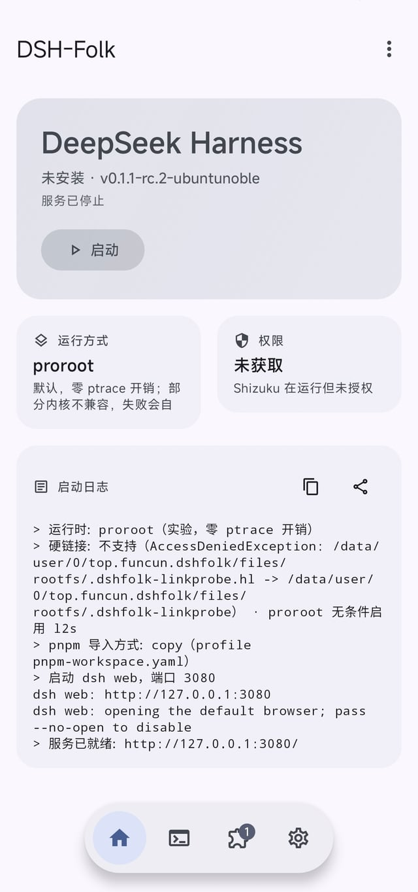
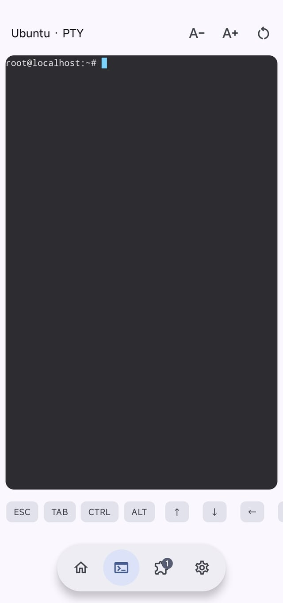
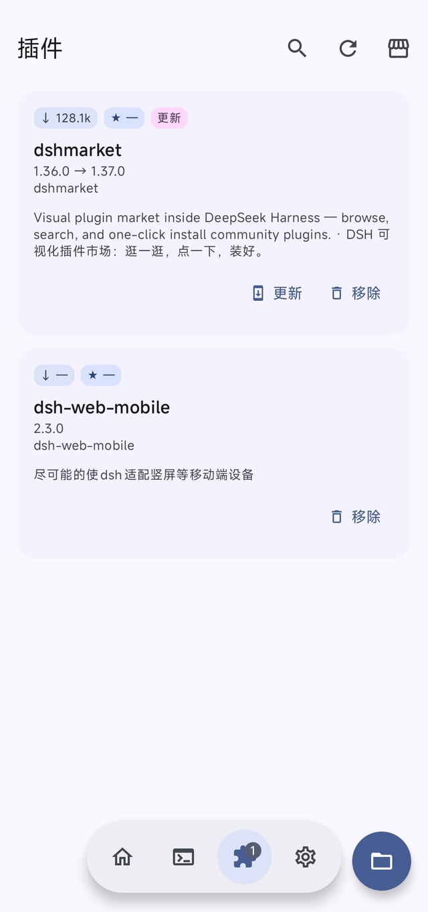
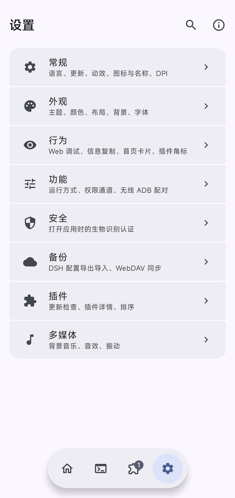

<div align="center">

# DSH-Folk (DSH-Fusion)

[简体中文](./README.md) | [English](./README.en.md)

**在 Android 上跑 DeepSeek Harness 的启动器**

> **DSH-Fusion 合并分支**：本仓库已与 [dsh-mobile-apk](https://github.com/kelai141/dsh-mobile-apk) (dm, v0.14.3)
> 合并 —— 保留 df 的原生 UI 与容器化设计（proot rootfs + 运行时管理），引入 dm 的
> 运行时实现逻辑（引擎看门狗自动重启、配置快照自动回滚、androidBridge 兼容桥）与
> 功能插件（@dsh-android/* 全家桶，经 CI 打包 tgz 后由插件商店安装）。
> 详见 [docs/MERGE.md](docs/MERGE.md)。

[](./LICENSE)
[](https://github.com/IPF-Sinon/DSH-Folk/actions/workflows/build.yml)
[](https://github.com/IPF-Sinon/DSH-Folk/releases/latest)

</div>

DSH-Folk 把 [DeepSeek Harness](https://www.npmjs.com/package/@deepseek-ai/dsh)（一个 Node.js 的编码 Agent CLI）装进手机：
应用下载一份 Linux 容器运行时（arm64 或 x86_64，按设备架构），用 proot / proroot 在容器里启动 `dsh web`，然后你在手机上直接打开它的 Web UI。

不需要 root，也不需要 Termux。有 root / Shizuku / 无线 ADB 时会自动利用，用于放宽某些受限操作。

## 目录

- [预览](#预览)
- [现在能做什么](#现在能做什么)
- [环境要求](#环境要求)
- [安装](#安装)
- [运行时管理](#运行时管理)
- [深入了解](#深入了解)
- [项目结构](#项目结构)
- [与 dsh-mobile-apk 的合并（DSH-Fusion）](docs/MERGE.md)
- [致谢](#致谢) · [许可证](#许可证) · [友情链接](#友情链接) · [交流](#交流)

深入的实现说明拆到了 `docs/` 下，按主题分文件（见 [深入了解](#深入了解)）。

## 预览

<div align="center">

| 主页 | 终端 |
| :---: | :---: |
|  |  |
| **插件** | **设置** |
|  |  |

</div>

## 现在能做什么

| 页面 | 说明 |
| --- | --- |
| **主页** | 一键启动 / 停止 / 重启 DSH，显示运行阶段、Web UI 地址、当前运行方式与权限通道，带可复制的启动日志 |
| **终端** | 容器内的真 PTY 终端（基于 Termux 的 `terminal-view`），直接 `bash` 进容器 |
| **插件** | 管理容器里 DSH 的插件，展示 npm 周下载量、GitHub star 与 dsh-market 点赞；内置插件商店（下载完整目录后本地搜索，4000+ 条），显示上游扫描出的能力与安全红线，支持本地 .tgz 安装。装完会用临时端口验证一次插件树能否加载，不通过自动卸载 |
| **设置** | 常规 / 外观 / 行为 / 功能 / 安全 / 备份 / 插件 / 多媒体，界面主题体系沿用 FolkPatch（`theme.json` 完全兼容） |

主题商店的入口在 **设置 → 外观** 页右上角；主题存档（`.fpt`）的导出与导入在商店页顶栏。

界面语言在 **设置 → 常规 → 语言** 里选，与系统语言无关（还有几套「风味」皮：魔法大厅 / 圣光之殿 /
后厨操作台 / 主世界 / 仙府主殿，只能从这里进）。启动日志、通知栏、Toast 与两个桥的报错都跟着这一项走，
不是跟着系统语言。

**配置备份**与 DSH 桌面端的 `dsh-config-manager` 插件使用同一套导出格式，手机上导出的 zip 能直接在电脑上导入，反之亦然；
凭据值默认不导出，可选整包 AES-256-GCM 加密。为什么中间那一段要由软件侧做，见 [备份为什么要由软件侧加密](docs/backup.md)。

## 环境要求

- Android 8.0 (API 26) 或更高
- **arm64-v8a** 或 **x86_64** 设备（不支持 32 位）
- 首次启动需要联网下载运行时（约 150 MB 压缩包，解压后约 600 MB；可在设置里选镜像或自动测速）
- 存储空间建议预留 2 GB 以上

首次启动下载完运行时后会自动预装四个插件：`dsh-web-mobile`（移动端适配）、`dshmarket`（WebUI 内的插件市场）、
`dsh-config-manager`（**配置备份功能的依赖**）、`dsh-file-upload`（拖拽上传 / 文档转 Markdown / 图片 OCR / 语音输入）。
失败不影响启动，之后可以在插件商店里手动装；预装清单按包名逐个记账，从旧版本升级上来会自动补装新增的那几个。

root / Shizuku / 无线 ADB 都是**可选**的，并且**默认不启用**。DSH-Folk 只探测并复用设备上已有的 su（Magisk / KernelSU / APatch）
与已授权的 Shizuku / Sui，自身不打任何内核补丁、不安装 su、不内置 Shizuku Server。要用就去
**设置 → 安全 → 权限通道 → 首选通道** 选一条（或选「自动」按 root > Shizuku > 无线 ADB 挑）。

选了通道后，App 自己（硬件监控、bugreport 的 dmesg/tombstones、重启菜单）与**容器里的 AI**（经 `dsh-native shell` 由 App 代跑）
都能用它；容器本身不需要 root。严格程度决定「用之前要不要问你」，默认**严格**（每次特权调用都弹窗）。
完整的权限模型、无线 ADB 的两把锁、AI 能通过桥调到宿主的哪些能力，见 [容器里能调宿主的什么](docs/host-bridges.md)。

## 安装

到 [Releases](https://github.com/IPF-Sinon/DSH-Folk/releases/latest) 下载**对应架构**的 APK，同目录的 `.sha256` 可用于校验：

- `DSH-Folk-<版本>-arm64-v8a.apk` —— 绝大多数手机、平板
- `DSH-Folk-<版本>-x86_64.apk` —— Android 模拟器、Android-x86、ChromeOS

两个包功能相同，区别只在打包的原生二进制与下载的容器 rootfs。装错架构会在启动时提示
「Unsupported architecture」并退出。不确定的话：手机选 arm64-v8a。

也可以到 [Actions](https://github.com/IPF-Sinon/DSH-Folk/actions/workflows/build.yml) 取开发构建：
选一次成功的运行，下载 `dsh-folk-debug-*` 或 `dsh-folk-release-*` 工件。

**测试版通道**：应用测试版在 **设置 → 常规 → 接受测试版更新** 打开后才会连预发布版一起看（默认关闭）；
容器运行时的测试版是独立开关（**设置 → 功能 → 运行时 → 接受测试版运行时更新**），两者互不影响。
测试版 / 正式版怎么发布、为什么这么发（release 变体、versionCode 约定、不用 Actions artifact 等），见
[构建与发布内幕](docs/dev-notes.md)。

应用自身的更新在 **设置 → 常规 → 检查更新** 里完成：它会对下载渠道（GitHub 直连 / gh-proxy 镜像）测延迟与吞吐，
下载支持断点续传，装之前必须通过 release 附带的 `.sha256` 校验 —— 校验不过一律不装。

## 运行时管理

**设置 → 功能 → 运行时** 那张卡：

- **更新**：一个按钮三种用法。没有检测到更新时点它就是「检查更新」；检测到更新时点它会先弹确认框
  （说明目标版本与保留的数据），确认后才开始下载；**长按**则列出仓库里所有运行时版本，可任意切换（降级也行）。
  要求比当前 App 更新的版本会标出并直接指路去更新应用 —— 那种包装上连容器都起不来。
- **重装**：重新下载当前通道的最新运行时，可选保留或清空会话、插件、配置与依赖数据。
- **导入**：安装本地 tar.gz（可信来源），会先显示文件名与体积供确认。
- **自动检查更新**：独立开关，默认**开**。开启后应用启动即自动检查运行时更新，发现新版本才提示；下载仍需手动确认。
  它与「应用更新」检测并行，但弹窗排队，避免两个「有更新」的弹窗叠在一起。

日志里 `dsh web: http://127.0.0.1:3080/?token=…` 那行是打开 WebUI 用的令牌，等同于这个实例的密码
（局域网访问默认关闭，只在本机可达）—— 贴日志求助前记得把它删掉。

预装插件时 pnpm 会刷一屏 `missing peer …` 警告，这是**预期的**（`@deepseek-ai/dsh-*`、`react` 这些 peer 由 dsh 自己解析）；
判断预装成没成看每个插件末尾的「预装完成 <包名>」与 `[DSH-Folk-exit] 0`，不是看这些警告。
运行时构建、rootfs 工作流、`minAppVersion` 门槛等内幕见 [构建与发布内幕](docs/dev-notes.md)。

## 深入了解

按主题拆到 `docs/` 下：

- [容器里能调宿主的什么（dsh-fs / dsh-native）](docs/host-bridges.md) —— 两个回环桥、24 项原生能力、特权命令（`shell`）、无障碍（`a11y`）与自助提权流程
- [备份为什么要由软件侧加密](docs/backup.md) —— 导出/导入格式、`DCA1` 容器、快照回退软件设置、WebDAV 云备份插件、五档档位
- [开机自启](docs/autostart.md) —— 开机广播 / 无障碍 / 开机脚本三条路径的取舍，以及两个无障碍开关分别是什么
- [日志采集与脱敏](docs/logs.md) —— bugreport 的文件归属、脱敏、时间窗口裁剪与 `session.lock` 处理
- [它是怎么跑起来的](docs/architecture.md) —— proot/proroot、rootfs、link2symlink、pnpm、ELF 闭包等运行链细节
- [构建与发布内幕](docs/dev-notes.md) —— 应用/运行时的发布工作流、测试版通道机制、更新说明为什么是本地资源

## 项目结构

```
app/src/main/java/me/bmax/apatch/
  dsh/                  运行时层：下载安装、proot 启动、权限探测、无线 ADB、PTY、配置备份
  ui/screen/HomeDsh.kt  主页
  ui/screen/Dsh*.kt     终端 / 插件 / 插件商店
  ui/screen/settings/   设置各分页
runtime-builder/        容器 rootfs 构建脚本（在 CI 上跑）+ 动态库闭包检查
.github/workflows/      build.yml（APK） + runtime.yml（rootfs）
docs/                   分主题的深入实现说明
```

内部包名保留 `me.bmax.apatch`（applicationId 是 `top.funcun.dshfolk`）：
这样 FolkPatch 的整套主题子系统与用户已有的 `theme.json` 不需要改一行就能继续用。

## 致谢

**DSH-Fusion 为独立维护项目**，未携带上游 git 历史。全部来源与许可见 [ACKNOWLEDGMENTS.md](ACKNOWLEDGMENTS.md)。

核心来源：DSH-Folk（UI / 容器化设计）、dsh-mobile-apk（运行时逻辑与 @dsh-android/* 插件）。

DSH-Folk 的 UI 直接复用 FolkPatch，容器与运行时交付思路来自 DSHA / DSHM（详见致谢文档）：

- [FolkPatch](https://github.com/LyraVoid/FolkPatch) —— 本项目的 UI 基础（GPL-3.0）
- [APatch](https://github.com/bmax121/APatch) —— FolkPatch 的上游
- [DSHA](https://github.com/DSH-APP/DSHA) —— 无线 ADB 配对方案、容器运行逻辑参考
- [DSHM](https://github.com/RochelimitDawn/DSHM) —— 运行时在线交付与镜像测速方案
- [DeepSeek Harness](https://www.npmjs.com/package/@deepseek-ai/dsh) —— 被启动的本体
- [proot](https://github.com/proot-me/proot) / [proroot](https://github.com/coderredlab/proroot) / [Termux](https://github.com/termux/termux-app) —— 容器执行与 PTY 终端
- [Shizuku](https://github.com/RikkaApps/Shizuku) —— 免 root 特权通道
- [KernelSU](https://github.com/tiann/KernelSU) / [SukiSU-Ultra](https://github.com/SukiSU-Ultra/SukiSU-Ultra) —— 界面设计参考

## 许可证

[GNU General Public License v3.0](./LICENSE)。本项目派生自 GPL-3.0 的 FolkPatch，因此整体沿用 GPL-3.0：
分发（含二次修改）必须同样以 GPLv3 开源并提供完整源码。

## 友情链接

LINUX DO 开源社区 | [linux.do](https://linux.do)

## 交流

- QQ 群：[1109060326](https://qm.qq.com/q/t7HDoR5ACk)
- Issues：https://github.com/IPF-Sinon/DSH-Folk/issues
